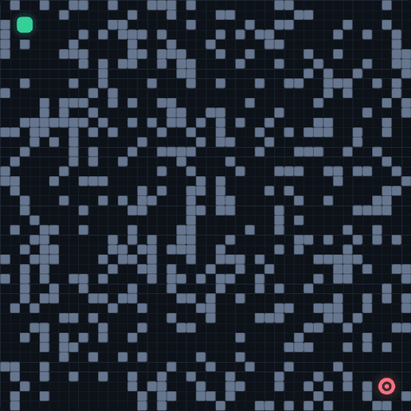
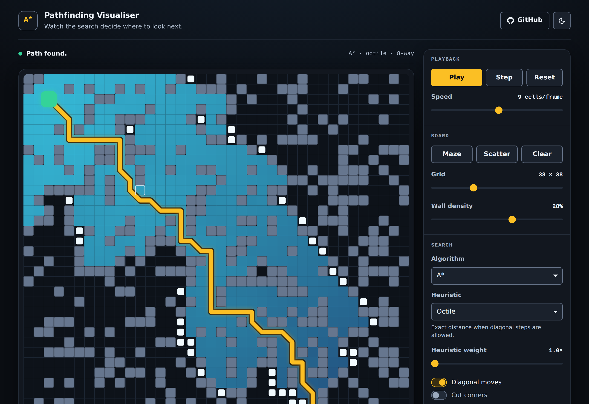
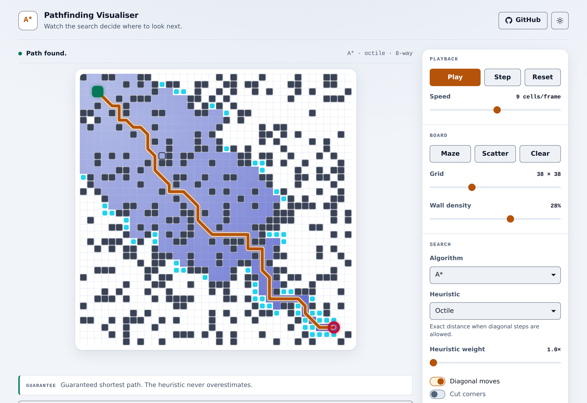

<div align="center">

# A\* Pathfinding Visualiser

**Watch A\* decide where to look next — one cell at a time.**

[](https://kamaljeetsahoo.github.io/A-star-Algorithm/)
[](#why-there-is-no-build-step)
[](#why-there-is-no-build-step)
[](https://github.com/KamaljeetSahoo/A-star-Algorithm/actions/workflows/ci.yml)
[](LICENSE)

### [→ Open the live demo](https://kamaljeetsahoo.github.io/A-star-Algorithm/)



<em>The pale pips are the frontier — cells seen but not yet settled. The blue field behind
them is everything A\* has finished with, shaded by how far it had to travel to get there.
The gold line is the shortest route.</em>

</div>

---

## What this is

A browser visualiser for the A\* search algorithm, built to be watched and read rather
than depended on. It started as a version of [The Coding Train's A\* coding
challenge](https://www.youtube.com/watch?v=aKYlikFAV4k) and has since been rewritten:
the search engine, the renderer and the page are new, and there are tests.

It is a teaching toy, not a library. There is no package to install and nothing to
import. If you want a pathfinder for real work, use a real one — but if you want to
*see* why A\* beats Dijkstra, open the demo and drag a wall around.

## What you can do with it

- **Draw the problem.** Click and drag on the board to paint walls; start on an existing
  wall and the same gesture erases. Drag the start or goal marker anywhere.
- **Watch it re-solve as you draw.** Once a run has finished, every edit re-runs the
  search instantly, so you can drag a wall across the route and watch the path bend.
- **Run it at your own pace.** Play, pause, or single-step one expansion at a time,
  anywhere from one cell every ten frames to several hundred per frame.
- **Switch the algorithm.** A\*, Dijkstra and greedy best-first are the same loop with
  a different scoring rule — flip between them on the same board and compare the
  `Expanded` count.
- **Change the heuristic** between octile, Manhattan, Euclidean and Chebyshev, and
  weight it from 1× to 3× to trade optimality for speed.
- **Generate a maze** (recursive backtracker, lightly braided) or scatter random walls
  at any density. Scattered boards are re-rolled until the goal is actually reachable.
- **Interrogate any cell.** Point at one and the readout under the board shows its
  `g`, `h` and `f`.
- **Use it without a mouse.** Focus the board and the arrow keys move a cell cursor;
  <kbd>Enter</kbd> toggles a wall, <kbd>1</kbd> and <kbd>2</kbd> drop the start and goal.
  State changes are announced to screen readers.



<details>
<summary>It has a light theme too</summary>



The canvas reads its colours from the same CSS custom properties as the rest of
the page, so the two themes are one stylesheet rather than two. The wake runs
the opposite way on white — palest at the start, deepening outward — because a
wake that faded out as it spread would lose its own edge against the page.

</details>

## How A\* actually works

Imagine you are hiking to a summit you can see on the horizon, and you reach a fork in
the trail. Two different instincts could guide you:

- **"Which fork have I spent the least effort reaching?"** Follow only that, and you
  explore outward from the trailhead in every direction, evenly. You will certainly find
  the best route — but you will have walked most of the mountain to do it. That is
  **Dijkstra's algorithm**.
- **"Which fork looks closest to the summit?"** Follow only that, and you charge straight
  at it — fast, right up until the trail dead-ends at a cliff you had no way of seeing.
  That is **greedy best-first search**.

A\* is the hiker who keeps both numbers in mind at once. For every fork it adds
**the effort already spent** to **the straight-line guess of what is left**, and always
takes the fork with the smallest total:

```
f(n) = g(n) + w · h(n)
       └┬─┘   └──┬──┘
        │        └── h: estimated cost from n to the goal ("as the crow flies")
        └── g: known cost of the cheapest route from the start to n
```

`g` is a fact — it is measured. `h` is a guess. The whole algorithm turns on one
property of that guess:

> **A heuristic must never overestimate.** If `h` is always less than or equal to the
> true remaining distance, it is called *admissible*, and A\* is guaranteed to return
> the shortest path. If it overestimates, A\* can talk itself out of the best route
> before it ever looks at it.

That is not an abstract caveat. Turn diagonal movement on and switch the heuristic to
Manhattan, and the page will tell you — in the Guarantee line under the board — that the
result may now be longer than necessary. Manhattan counts a diagonal step as costing 2
when it really costs √2, so it overestimates, and the guarantee is gone. There is a test
in this repo that checks it really does return worse paths in that configuration.

### The loop itself

A\* keeps two collections: a **frontier** of cells it has seen but not finished with,
and the **settled** cells it has. Then it repeats four steps:

1. Take the cell with the smallest `f` off the frontier.
2. If it is the goal, stop — and only *now* is the route known to be the cheapest one.
3. Otherwise settle it, and look at each neighbour.
4. If you have just found a cheaper route to a neighbour than any known before, record
   the new cost and the step you took to get there, and put it on the frontier.

Step 2 is subtler than it looks. Reaching the goal only proves *some* route exists;
popping it off the frontier proves no cheaper route is still outstanding. Stopping early
is the single most common way to get a plausible, wrong answer.

### Which heuristic, and why

The right heuristic is the exact distance for the moves you allow, ignoring walls. Any
looser guess is still safe, but A\* pays for the slack by exploring more.

| Heuristic | Formula | Exact for | Admissible with diagonals? |
|---|---|---|---|
| **Octile** | `max + (√2−1)·min` | 8-way movement, √2 diagonals | ✅ exact — the default |
| **Euclidean** | `√(dx² + dy²)` | straight-line travel | ✅ safe, but loose |
| **Chebyshev** | `max(dx, dy)` | 8-way with cost-1 diagonals | ✅ safe, but loose |
| **Manhattan** | `dx + dy` | 4-way movement | ❌ **overestimates** |

Turning the weight `w` above 1 gives **Weighted A\***: it explores noticeably less and
gets there sooner, at the price of a path that can be up to `w` times longer than the
best one. The demo states that bound rather than hiding it, and a test enforces it.

## Reading the board

| | Meaning |
|---|---|
| **Pale pips** | The frontier — seen, not yet settled. This is A\*'s to-do list. |
| **Blue field** | Settled cells, shaded by `g`: brightest near the start, cooling as the search reaches further. The shading turns the explored region into a distance map. |
| **Grey blocks** | Walls. |
| **Thin gold line** | The best route *currently* known. It writhes around as better options turn up — this is A\* changing its mind. |
| **Solid gold line** | The finished, proven path. |
| **Green square / red ring** | Start and goal. Different shapes, not just different colours. |

The most interesting thing to watch is the shape of the blue field. With a good
heuristic it is a narrow beam pointing at the goal; switch to Dijkstra and it balloons
into a circle, because nothing is pulling it in any particular direction.

## Run it locally

There is nothing to install.

```bash
git clone https://github.com/KamaljeetSahoo/A-star-Algorithm.git
cd A-star-Algorithm
open index.html          # or: xdg-open index.html, or just double-click it
```

It works straight off the filesystem. If you would rather serve it:

```bash
python3 -m http.server 8000    # then visit http://localhost:8000
```

To run the tests you need Node 20 or newer, but nothing from npm:

```bash
npm test          # search-engine tests, via node --test
npm run audit     # checks every colour pair in the stylesheet for contrast
```

## How the code is laid out

```
index.html            markup and the control panel
assets/css/app.css    all styling, and every colour the canvas paints with
src/
  heap.js             indexed binary min-heap — the frontier
  grid.js             the board, and which neighbours a cell has
  search.js           A* / Dijkstra / greedy best-first, one expansion at a time
  maze.js             recursive-backtracker maze generation
  renderer.js         canvas drawing; reads its palette from the CSS
  app.js              wiring, controls, pointer and keyboard input
tests/
  engine.test.js      optimality, heuristics, corner rules, heap invariants
  edge-cases.test.js  degenerate boards, awkward grid sizes, reopening
tools/contrast-audit.js
                      contrast checker for both theme palettes
```

`search.js` is the interesting one, and it is meant to be read. The three algorithms
differ only in how `#priority` scores a cell.

### Why there is no build step

The source files are plain classic scripts that declare classes in the global scope and
are loaded in dependency order — which is exactly why `index.html` opens from a
`file://` URL with no server, no bundler and no `node_modules`. The tests load the same
files the browser does, by evaluating them in one shared scope, so there is no second
copy of the code to keep in sync.

The trade is deliberate: this repo optimises for *being read and poked at* over being
consumed as a package.

## Implementation notes

- **The frontier is an indexed binary heap**, not an array scanned for its minimum. When
  A\* finds a cheaper route to a cell already on the frontier, the heap re-sorts that one
  entry in place instead of inserting a duplicate — which keeps the `Frontier` count in
  the readout honest.
- **Diagonal steps cost √2**, not 1. Charging them 1 quietly makes diagonal routes look
  cheaper than they are, and then no heuristic you pick is the right one.
- **Corner cutting is refused by default.** A diagonal move between two walls that touch
  at a corner is not a move anything could physically make, so it is rejected unless you
  tick the box.
- **Settled cells can be reopened.** With an admissible, consistent heuristic a settled
  cell never needs revisiting — but Weighted A\* and Manhattan-with-diagonals break that
  guarantee, and without reopening, the path silently degrades with no error. Greedy
  best-first is the exception: it scores on `h` alone, so a cheaper `g` cannot change its
  mind and reopening would be pure churn.
- **Ties break toward the goal.** On a uniform grid enormous numbers of cells share an
  `f`. Preferring the smaller `h` among them means preferring the larger `g` — the cell
  further along rather than the one that merely looks promising. It costs nothing in
  optimality and collapses a fat symmetric blob into a narrow beam.

### Limits

- The grid tops out at 100×100. The algorithm would go further; redrawing every cell each
  frame is what would not.
- The board is not resampled when you change the grid size — it is regenerated.
- No Jump Point Search, no weighted terrain, no multi-agent anything.

## Credits

The original version of this project was built from [The Coding
Train](https://thecodingtrain.com/)'s A\* coding challenge, which is the clearest
introduction to this algorithm on the internet. The `openSet`/`closedSet` framing came
from there.

The algorithm itself is due to Hart, Nilsson and Raphael, *A Formal Basis for the
Heuristic Determination of Minimum Cost Paths* (1968).

## License

[MIT](LICENSE) © Kamaljeet Sahoo
